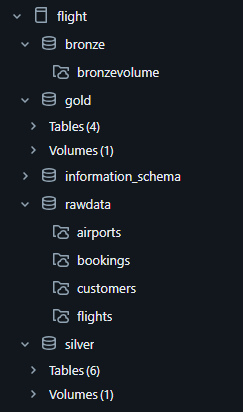

# 🛫 Databricks Flights Data Pipeline Project

This is an **end-to-end data engineering project** on Databricks that demonstrates the modern **medallion architecture** — processing raw airline data through Bronze, Silver, and Gold layers using Delta Lake, Auto Loader, and SQL transformations.

> 🎥 [Watch Demo Video](https://youtu.be/vT7Oeu7WqHg?si=ujHz9mqmH2TD_l3H)  
> 📂 [GitHub Repo](https://github.com/PJ9172/Databricks_FlightsData.git)

---

## 🔍 Project Overview

The main goal of this project is to build a **robust data lakehouse** that ingests, transforms, and serves flight-related datasets such as:

- ✈️ Flights
- 🧑 Customers
- 🧾 Bookings
- 🗺️ Airports

This pipeline follows the **Lakehouse Architecture**:
- Ingest raw data into **Bronze Layer**
- Transform and clean into **Silver Layer**
- Create dimensional and aggregated tables in the **Gold Layer**

---

## 🧱 Architecture

```
              ┌────────────┐
              │  Raw Data  │
              └────┬───────┘
                   ▼
            ┌─────────────┐
            │ Bronze Layer│  <- Ingested using Auto Loader
            └────┬────────┘
                 ▼
           ┌─────────────┐
           │ Silver Layer│  <- Cleaned and Joined DataFrames
           └────┬────────┘
                ▼
          ┌────────────┐
          │ Gold Layer │  <- Final Fact/Dim Tables for BI
          └────────────┘
```

---

## 🗂️ Catalog Structure (Databricks)

```
flight/
├── rawdata/
│   ├── airports/
│   ├── bookings/
│   ├── customers/
│   └── flights/
├── bronze/
│   └── bronzevolume/
├── silver/
│   └── Tables (6)
├── gold/
│   └── Tables (4)
└── information_schema/
```

> 📸 Catalog Preview:  


---

## ⚙️ Technologies Used

- **Databricks Community Edition**
- **Delta Lake**
- **PySpark & SQL**
- **Auto Loader (Streaming Ingestion)**
- **Medallion Architecture (Bronze → Silver → Gold)**
- **Unity Catalog (Structured Tables)**

---

## 📌 Features

- ✅ Automatic schema inference and evolution with Auto Loader
- ✅ Layered transformation logic (raw → bronze → silver → gold)
- ✅ Cleaned joins between customers, flights, airports, and bookings
- ✅ Aggregated Gold tables ready for reporting
- ✅ Catalog integration using Unity Catalog volumes and tables

---

## 🚀 How to Run

1. Clone the repository:

```bash
git clone https://github.com/PJ9172/Databricks_FlightsData.git
```

2. Import notebooks into Databricks:
   - Use the **workspace UI** to import `.dbc` or individual notebooks.
   - Attach to a cluster and run cells in order.

3. Upload the raw data to `dbfs:/Volumes/flight/rawdata/`.

4. Start from Bronze ingestion → Silver transformation → Gold layer creation.

---

## 📊 Sample Outputs (Gold Layer)

> ✨ Examples:
- Top 10 most booked airports
- Flight count by customer region
- Revenue by booking channel
- Frequent fliers with booking history

---

## 🙏 Acknowledgements

- Inspired by [YouTube Tutorial](https://youtu.be/vT7Oeu7WqHg?si=ujHz9mqmH2TD_l3H)
- Built on **Databricks Free Tier**

---

## 📬 Connect with Me

- 🔗 GitHub: [PJ9172](https://github.com/PJ9172)
- 💼 LinkedIn: [Prajwal-Jagtap](www.linkedin.com/in/prajwal-jagtap)

---
